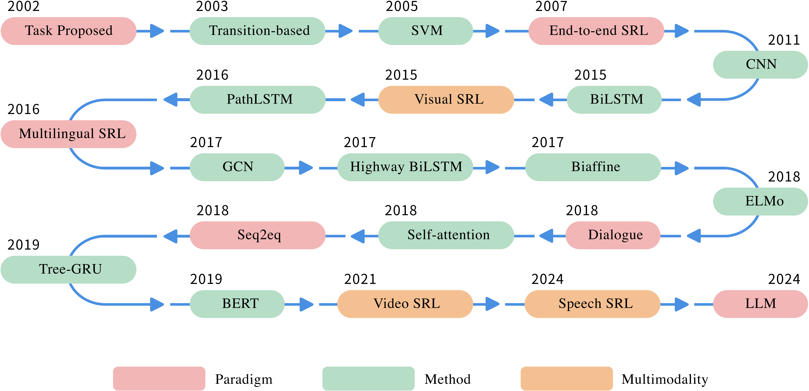

# Awesome-SRL

Awesome paper about semantic role labeling

The organization of papers is discussed in our survey: [Semantic Role Labeling: A Systematical Survey](https://arxiv.org/abs/2502.08660).

If you find any relevant academic papers that have not been included in our research, please submit a request for an update. We welcome contributions from everyone.

If any suggestions or mistakes, please feel free to let us know via email at **chenhy1018@gmail.com**. We appreciate your feedback and help in improving our work.

If you find our survey useful for your research, please cite the following paper:

    @article{chen2025semantic,
    title={Semantic Role Labeling: A Systematical Survey},
    author={Chen, Huiyao and Zhang, Meishan and Li, Jing and Zhang, Min and {\O}vrelid, Lilja and Haji{\v{c}}, Jan and Fei, Hao},
    journal={arXiv preprint arXiv:2502.08660},
    year={2025}
    }

## 📒 Table of Contents (Continuous updating...)
<!-- - [Information Extraction tasks](#information-extraction-tasks)
    - [Named Entity Recognition](#named-entity-recognition)
    - [Relation Extraction ](#relation-extraction)
    - [Event Extraction](#event-extraction)
    - [Universal Information Extraction](#universal-information-extraction)
- [Information Extraction Techniques](#information-extraction-techniques)
    - [Supervised Fine-tuning](#supervised-fine-tuning)
    - [Few-shot ](#few-shot)
    - [Zero-shot](#zero-shot)
    - [Data Augmentation](#data-augmentation)
    - [Prompts Design](#prompts-design)
    - [Constrained Decoding Generation](#constrained-decoding-generation)
- [Specific Domain](#specific-domain)
- [Evaluation and Analysis](#evaluation-and-analysis)
- [Project and Toolkit](#project-and-toolkit) -->
<!-- - ⏰ [Recently Updated Papers](#recently-updated-papers) (After 2025/02/09, the updated papers is here~) -->
- ⭐️ [Datasets](#datasets) (with Download Link~)
    - [Textual SRL](#textual-srl)
    - [Visual SRL](#visual-srl)
    - [Video SRL](#video-srl)
    - [Speech SRL](#speech-srl)

## Project Format Reference

This project follows the format of [Awesome-LLM4IE-Papers](https://github.com/quqxui/Awesome-LLM4IE-Papers/blob/main/README.md).

# Datasets
A taxonomy by various modals.
## Textual SRL
| Dataset | Style | Corpus | Scale | Scenario | Languages | Link |
| :----- | :-------: | :--------------: | :-------: | :---------: |:---------: |:---------: |
| [FrameNet](https://aclanthology.org/P98-1013.pdf) | FrameNet | British National Corpus | > 200,000 | sentence | En | [Link](https://framenet.icsi.berkeley.edu/) |
| [PropBank](https://aclanthology.org/J05-1004.pdf) | PropBank | PTB, robotic surgery books | > 100,000 | sentence | En | [Link](https://verbs.colorado.edu/~mpalmer/projects/ace.html) |
| [CoNLL 2005](https://aclanthology.org/W05-0620.pdf) | PropBank | Wall Street Journal in PTB,   Brown corpus in PTB | 44,020 | sentence | En | [Github   (Only Test)](https://github.com/PaddlePaddle/Paddle/blob/release/1.6/python/paddle/dataset/conll05.py#L205) |
| [CoNLL 2009](https://aclanthology.org/W09-1201.pdf) | PropBank | PTB 3, BBN's NE, PropBank 1, NomBank CPB AnCora Prague Dependency Treebank 2.0 SALSA Kyoto University | 41,678 24,833 31,116 42,940 38,020 4,893 | sentence | En Zh Ca, Es Cs De Ja | [Link   (Ca, Es, Cs, De, Ja)](https://catalog.ldc.upenn.edu/LDC2012T03)   [Link   (En, Zh)](https://catalog.ldc.upenn.edu/LDC2012T04)|
| [NomBank](https://aclanthology.org/W04-2705.pdf) | NomBank | NOMLEX-PLUS, PTB | 114,576 | sentence | En | [Link](https://catalog.ldc.upenn.edu/LDC2008T23) |
| [CoNLL 2012](https://aclanthology.org/W12-4501.pdf) | PropBank | OntoNotes | 94,269   47,042   9,395 | sentence | En   Zh   Ar | [Link](https://conll.cemantix.org/2012/data.html) |
| [HuRIC](https://www.sciencedirect.com/science/article/pii/S0004370218302935#tbl0030) | FrameNet | Human Robot Interaction | 897 | command | En, It | [Link](http://sag.art.uniroma2.it/demo-software/huric/) |
| [ConSD](https://arxiv.org/pdf/1911.02851) | PropBank | PTB, PropBank, NomBank | 44,020 | sentence | En |  |
| [Universal PropBank](https://aclanthology.org/2022.lrec-1.181.pdf) | PropBank | UD | 3,860,000 | sentence | Cs, De, El, Es, Fi, Fr, Hi, Hu, Id, It, Ja, Ko, Mr, Nl, Pr, Pt, Ro, Ru, Ta, Te, Uk, Vi, Zh | [Link](https://universalpropositions.github.io/) |

## Visual SRL
| Dataset | Corpus | Scale | Scenario | Languages | Link |
| :----- | :--------------: | :-------: | :---------: |:---------: |:---------: |
| [V-COCO](https://arxiv.org/pdf/1505.04474) | COCO | 10,000 | image | En | [GitHub](https://github.com/s-gupta/v-coco) |
| [SituNet](https://www.cv-foundation.org/openaccess/content_cvpr_2016/papers/Yatskar_Situation_Recognition_Visual_CVPR_2016_paper.pdf#:~:text=In%20this%20paper%2C%20we%20argue%20for%20explicitly%20en-coding,in%20cur-rent%20paradigms%20of%20recognition%2C%20in%20image%20understanding.) | Google image | 126,102 | image | En | [GitHub](https://github.com/my89/imSitu) |
| [SWiG](https://www.ecva.net/papers/eccv_2020/papers_ECCV/papers/123490307.pdf) | Google image | 126,102 | image | En | [GitHub](https://github.com/allenai/swig) |
| [ExHVV](https://arxiv.org/pdf/2212.00715) | HVVMemes | 4,680 | image | En | [GitHub](https://github.com/shiv6891/EXCLAIM_WEB/tree/7a28639e2867ad55f1397ba13bf4bbcbe6a344d8/Artifacts/Data) | 

## Video SRL
| Dataset | Corpus | Scale | Scenario | Languages | Link |
| :----- | :--------------: | :-------: | :---------: |:---------: |:---------: |
| [VidStu](https://openaccess.thecvf.com/content/CVPR2021/papers/Sadhu_Visual_Semantic_Role_Labeling_for_Video_Understanding_CVPR_2021_paper.pdf) | MovieClips | 3,037 | video | En | [GitHub](https://github.com/TheShadow29/VidSitu) |

## Speech SRL
| Dataset | Corpus | Scale | Scenario | Languages | Link |
| :----- | :--------------: | :-------: | :---------: |:---------: |:---------: |
| [AS-SRL](https://aclanthology.org/2024.findings-acl.527.pdf) | AISHELL-1, CPB | 9,000 | speech | Zh | [GitHub](https://github.com/DreamH1gh/SpeechSRL) |

